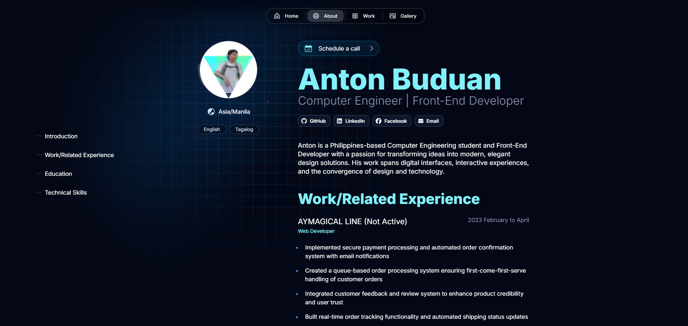

A modern, responsive portfolio website built with Next.js and Once UI.

## **About**

This portfolio showcases my work as a Front-End Developer. It features:
- Modern, responsive design
- Interactive UI elements
- Project showcases
- Work experience
- Technical skills

## **Tech Stack**

Built with:
- [Next.js](https://nextjs.org)
- [Once UI](https://once-ui.com)
- React
- TypeScript

## **Features**

- Responsive design
- Dark/Light mode
- Interactive animations
- Project gallery
- Work experience timeline
- Contact information

## **Contact**

Feel free to reach out:
- Email: antonbuds7@outlook.com
- GitHub: [anton-buds](https://github.com/anton-buds)
- LinkedIn: [Anton Buduan](https://www.linkedin.com/in/anton-buduan/)

# **What I used to make this Portfolio**

I used [Magic Portfolio](https://github.com/once-ui-system/magic-portfolio) that was built with [Once UI](https://once-ui.com) for [Next.js](https://nextjs.org) by Lorant One and its contributors. It requires Node.js v18.17+.

# **Authors**

Connect with the team on Threads or LinkedIn.

Lorant Toth: [Threads](https://www.threads.net/@lorant.one), [LinkedIn](https://www.linkedin.com/in/tothlorant/)  
Zsofia Komaromi: [Threads](https://www.threads.net/@zsofia_kom), [LinkedIn](https://www.linkedin.com/in/zsofiakomaromi/)

Localization added by [François Hernandez](https://github.com/francoishernandez)

# **Get involved**

- Join the [Design Engineers Club on Discord](https://discord.com/invite/5EyAQ4eNdS) and share your portfolio with us!
- Report a [bug](https://github.com/once-ui-system/magic-portfolio/issues/new?labels=bug&template=bug_report.md).

# **License**

Distributed under the CC BY-NC 4.0 License.
- Commercial usage is not allowed.
- Attribution is required.

See `LICENSE.txt` for more information.

# **Deploy with Vercel**

